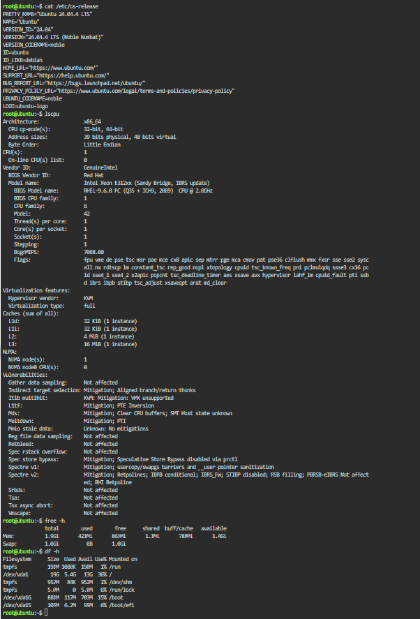

## Linux System Investigation (KillerCoda)

Using a KillerCoda Playground, I gathered the following system information:

- **Operating System:** Ubuntu 24.04.4 LTS (Noble Numbat)
- **CPU:** Intel Xeon E312xx (Sandy Bridge), 1 vCPU, 1 core/1 thread, 2.0GHz, KVM virtualization
- **Memory:** 1.9 GiB total, 408 MiB used, 873 MiB free, 1.5 GiB available
- **Disk Space:** 19 GB root filesystem (`/dev/vda1`), 5.4 GB used, 13 GB available (30% used)

### Linux Commands Used

The commands used in KillerCoda terminal are:

- `cat /etc/os-release` — displays the **Ubuntu operating system version**.
- `lscpu` — displays **CPU information**, such as model, cores, threads, and virtualization.
- `free -h` — displays **memory (RAM) usage**.
- `df -h` — displays **disk space usage**.

## Terminal Output

## Cloud Migration

If this Linux server were migrated to the cloud, these services could host it:

- **AWS – Amazon EC2:** Provides virtual machines that can run Linux operating systems.
- **Microsoft Azure – Azure Virtual Machines:** Provides virtual machines for running Linux servers and applications.
- **GCP – Compute Engine:** Provides virtual machines that can run Linux servers in Google Cloud.